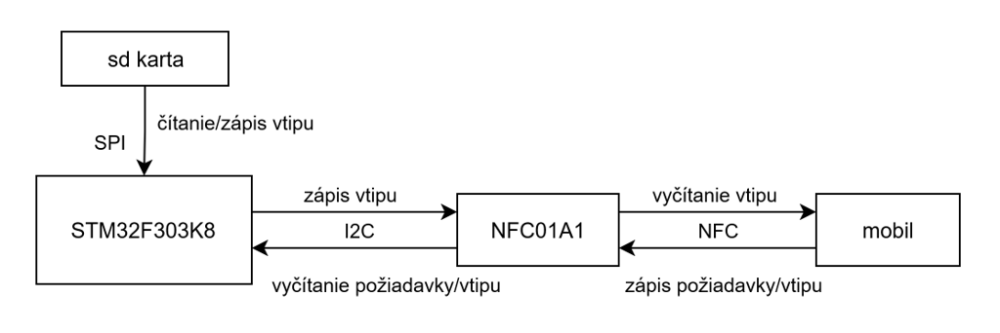

## 1.1 PREHĽAD PROJEKTU

Cieľom projektu je vytvoriť  zariadenie založené na mikrokontroléri STM32F303K8,
ktoré umožní používateľovi získať vtip  prostredníctvom NFC komunikácie s mobilným telefónom alebo nahrať vtip do
databázy.

Generovanie vipov bude fungovať nasledovne:
používateľ pomocou mobilnej aplikácie odošle NFC požiadavku na zariadenie, mikrokontrolér následne načíta náhodný vtip zo SD karty a zapíše odpoveď späť do pamäte NFC tagu, odkiaľ ju aplikácia prečíta a zobrazí na displeji telefónu. Používateľ bude mať tiež možnosť nahrať svoj vlastný vtip do databázy, vtip bude cez NFC odoslaný na zariadenie, mikrokontrolér tento vtip načíta z pamäte NFC tagu a následnho ho uloží do databázy na SD karte.

## 1.2 Vlastnosti

Dynamická NFC komunikácia (request → response)

čítanie/zapisovanie vtipov z/do databázy na SD karte

SPI komunikácia so SD kartou

I2C komunikácia s NFC tag modulom (X-NUCLEO-NFC01A1)

Vlastná mobilná aplikácia pre Android (read/write NFC)

## Členovia tímu

Angelika Loduhová

Tomáš Major

Janíček Radoslav

Štefan Kordoš

#SYSTÉMOVÁ ARCHITEKTÚRA

## 2.1 Blokový diagram systému

## 2.2 Tok dát

Mobilná aplikácia zapíše NFC požiadavku alebo vtip do NFC tagu.

STM32 prijme signál o zmene dát (GPO).

STM32 načíta NFC správu cez I2C.

STM32 vyberie náhodný vtip zo súboru uloženého na SD karte (SPI) alebo zapíše vtip na uloženie do databázy.

STM32 zapíše odpoveď späť do NFC tagu cez I2C.

Mobilná aplikácia načíta odpoveď a zobrazí text používateľovi.

## HARDVÉROVÁ ŠPECIFIKÁCIA

## 3.1 Komponenty

MCU	STM32F303K8 (Nucleo) - Riadenie systému

NFC Modul	X-NUCLEO-NFC01A1 - I2C + NFC komunikácia

SD karta - Ukladanie databázy vtipov

## úloha 1: Čítanie/zápis vtipov zo SD karty (SPI)

Inicializácia SPI a FATFS

Otváranie súborov so zoznamom vtipov

Zápis a čítanie vtipu z/do súboru

Priradený člen: Tomáš Major

## úloha 2: Čítanie požiadaviek z NFC modulu (I2C)

Integrácia knižnice pre NFC modul

Inicializácia I2C komunikácie

Detekcia zápisu na NFC tag cez GPO pin

Čítanie prichádzajúcej požiadavky alebo vtipu

Priradený člen: Štefan Kordoš

## úloha 3: Zápis odpovedí do NFC modulu (I2C)

Spracovanie prichádzajúcej požiadavky

Zápis vtipu na NFC modul cez I2C

Hlavná logika programu

Priradený člen: Radoslav Janíček

## úloha 4: Android aplikácia

Implementácia NFC komunikácie (write/read)

Vytvorenie používateľského rozhrania

Odosielanie požiadavky a prijatie odpovede

Posielanie vtipu na uloženie do databázy

Zobrazenie prijatého textu

Priradený člen: Angelika Loduhová